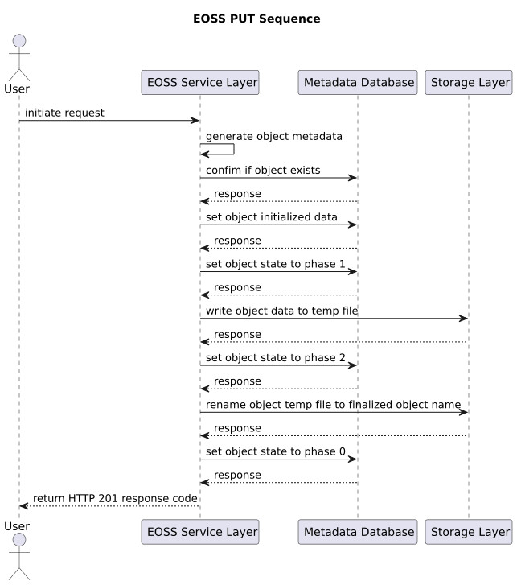

# Eric's Object Storage Service

## Intro

Eric's Object Storage Service(EOSS) is my experimental object storage service. I designed EOSS with following features:

* support object versioning
* support HTTP HEAD/GET/PUT/DELETE methods for object operations
* support object writing operation rollback if failure occurs
* support safe mode
* support concurrent writing
* object metadata and object files should be easy to move around

EOSS uses local filesystem as the storage layer.

## Technical Details

### Components

EOSS has 3 pieces of components: EOSS Service, Metadata Database and Storage Layer. EOSS Service is a Flask application that is written by Python 3. Metadata Database uses SQLite to store the object metadata. Storage Layer is local filesystem or local-mounted NFS share.

### Metadata Database Schema

Metadata Database(MDS) uses SQLite as the metadata store.

| Column Name | Type | Description |
|-------------|------|-------------|
| id | String | object name |
| filename | String | object original filename |
| version | String | object version |
| size | Integer | object size |
| timestamp | Integer | latest updated timestamp |
| state | Integer | object writing state |

### Object Versioning

To support object versioning, the user needs to specify a special string called *version salt*, this version salt will be used to construct the final version string by base64 method. Once the user passes version string by using the header **X-EOSS-Object-Version**, EOSS will construct the a string in the following format:

```
<object filename>:<version salt>:<version string>
```

then EOSS applies base64 method on the string as the final object name. Here's an example:

```
object filename: testfile100m
version salt: snoopy
version string: ver1.0

=>

testfile100m:snoopy:ver1.0

=>

dGVzdGZpbGUxMDBtOnNub29weTp2ZXIxLjA=
```

The version salt should not be shared with end users.

### Object Writing State

EOSS uses 3 integers to object writing states. In each phase, EOSS will update MDS with proper state integer. When an object is uploading, following phases are triggered:

* set an exclusive lock on a lock file with a ".lock" suffix in object name in storage layer
* object writing request initialized
* object data is saved with a ".temp" suffix in object name in storage layer
* object file is renamed to the final object name

| Number | Description |
|--------|-------------|
| 1 | initial state - object writing request initialized |
| 2 | object is saved on storage layer with a temp suffix |
| 0 | final state - object is renamed to final object name |

### Object Writing Operation Rollback

In order to avoid inconsistent state left if uploading is failed, a rollback operation is necessary to ensure all writing is atomic. Rollback feature only exists in uploading function(HTTP PUT method). 

If any MDS update or object storing operations go wrong, the rollback function will be triggered. The rollback function will delete the data on the storage layer first then removing the object record from MDS.

If rollback is failed, it's possible the service is still in inconsistent state. But such leftover states would be cleaned up when service restarts.

### Object Concurrent Write

EOSS utilizes a simplified Two-Phase Locking mechanism to address concurrent write scenarios. Prior to initiating the actual write, an exclusive lock is placed on a lock file. Instead of waiting for the transaction to complete, EOSS promptly returns an HTTP response code 409 to the client, indicating the detection of concurrent writes and advising the client to retry at a later time.

### Safe Mode

Safe Mode is a special operational mode in EOSS. Once Safe Mode is enabled, all READ operations(HTTP HEAD and GET methods) is still working but all WRITE(HTTP PUT and DELETE methods) operations would be failed.

This feature is useful when service administrator needs to maintain the service but not interrupting users to read objects.

### HTTP Response Codes

EOSS obeys most standard HTTP response codes. Following table lists EOSS customized HTTP response codes:

| HTTP Response Code | Text | Description |
|--------------------|------|-------------|
| 409 | Object Read/Write Conflict | read or write on the same object that has exclusive lock |
| 440 | Object Initialized Only | object is just initialized, not ready for serving |
| 441 | Object Saved Not Closed | object is saved with a temp suffix, not ready for serving |
| 520 | MDS Connection Failure | failed to connect MDS |
| 521 | MDS Execution Failure | failed to execute SQL queries on MDS |
| 522 | MDS Commit Failure | failed to commit transactions to MDS |
| 523 | EOSS Internal Exception Failure | EOSS encounters exceptions that are unable to catch |
| 524 | EOSS Inconsistent Condition Failure | EOSS encounters internal inconsistency issue |
| 525 | EOSS Safemode Enabled | Safe Mode is enabled on EOSS |
| 526 | EOSS Rollback Done | Rollback procedure is successful |
| 527 | EOSS Rollback Failed | Rollback procedure is failed |

## HTTP Endpoints

Each HTTP response from EOSS would have a special header called **X-EOSS-Request-ID** which is used to identify source request.

### /eoss/v1/object

**object** endpoint is used for users to handle object operations like download/upload/delete. 

#### HTTP HEAD Method

HTTP HEAD method is used for checking if object exists or not.

##### Data Flow


##### Example

```
$ curl -I http://localhost:4080/eoss/v1/object/testfile100m -H "X-EOSS-Object-Version: ver1.0"
HTTP/1.1 200 OK
Content-Type: text/html; charset=utf-8
Content-Length: 13
X-EOSS-Request-ID: 1010f676-5e58-4681-b0cd-bb117d2440fe
```

#### HTTP GET Method

HTTP GET method is used for downloading object.

##### Data Flow


##### Example

```
$ curl http://localhost:4080/eoss/v1/object/testfile100m -H "X-EOSS-Object-Version: ver1.0" -o testfile100m.example -v -s
*   Trying 127.0.0.1:4080...
* Connected to localhost (127.0.0.1) port 4080 (#0)
> GET /eoss/v1/object/testfile100m HTTP/1.1
> Host: localhost:4080
> User-Agent: curl/7.85.0
> Accept: */*
> X-EOSS-Object-Version: ver1.0
> 
* Mark bundle as not supporting multiuse
< HTTP/1.1 200 OK
< Content-Disposition: attachment; filename=testfile100m
< Content-Type: application/octet-stream
< Content-Length: 104857600
< Last-Modified: Wed, 12 Apr 2023 04:27:50 GMT
< Cache-Control: no-cache
< ETag: "1681273670.2883308-104857600-2117080245"
< Date: Sun, 23 Apr 2023 18:06:14 GMT
< X-EOSS-Request-ID: 75ac9c35-5a03-47fd-a992-3b553585f9a6
```

#### HTTP PUT Method

HTTP PUT method is used for uploading object.

If the object exists in the storage already, HTTP PUT will re-write the same object.

##### Data Flow



##### Example

```
$ curl -X PUT -T testfile.100M http://localhost:4080/eoss/v1/object/testfile100m -H "X-EOSS-Object-Version: ver2.0" -v -s
*   Trying 127.0.0.1:4080...
* Connected to localhost (127.0.0.1) port 4080 (#0)
> PUT /eoss/v1/object/testfile100m HTTP/1.1
> Host: localhost:4080
> User-Agent: curl/7.85.0
> Accept: */*
> X-EOSS-Object-Version: ver2.0
> Content-Length: 104857600
> Expect: 100-continue
> 
* Done waiting for 100-continue
* We are completely uploaded and fine
* Mark bundle as not supporting multiuse
< HTTP/1.1 201 CREATED
< Content-Type: text/html; charset=utf-8
< Content-Length: 15
< X-EOSS-Request-ID: a9ae69a8-38f6-4de2-8489-12ed52aa041f
Object Uploaded
```

#### HTTP DELETE Method

HTTP PUT method is used for deleting object.

##### Data Flow


##### Example

```
$ curl -X DELETE http://localhost:4080/eoss/v1/object/testfile100m -H "X-EOSS-Object-Version: ver2.0" -v -s
*   Trying 127.0.0.1:4080...
* Connected to localhost (127.0.0.1) port 4080 (#0)
> DELETE /eoss/v1/object/testfile100m HTTP/1.1
> Host: localhost:4080
> User-Agent: curl/7.85.0
> Accept: */*
> X-EOSS-Object-Version: ver2.0
> 
* Mark bundle as not supporting multiuse
< HTTP/1.1 200 OK
< Content-Type: text/html; charset=utf-8
< Content-Length: 14
< X-EOSS-Request-ID: e28ac80c-4771-4aea-97aa-5142d8548889
Object Deleted
```

### /eoss/v1/stats

**stats** endpoint reads MDS and display a summary in JSON format. Following fields are included:

| Field Name | Description |
|------------|-------------|
| total_number_objects | total number of objects |
| total_storage_usage | total storage space usage in byte |
| youngest_object_updated_timestamp | youngest object updated timestamp |
| oldest_object_updated_timestamp | oldest object updated timestamp |
| number_object_upload_init | total number of objects that are just initialized(state 1) |
| number_object_saved_in_temp_name | total number of objects that are saved with a temp suffix(state 2) |
| number_object_uploaded | total number if objects that are uploaded that are in finalized state(state 0) |

##### Example

```
$ curl http://localhost:4080/eoss/v1/stats -s | json_pp 
{
   "number_object_saved_in_temp_name" : 0,
   "number_object_upload_init" : 0,
   "number_object_uploaded" : 14,
   "oldest_object_updated_timestamp" : 1681488651,
   "total_number_objects" : 14,
   "total_storage_usage" : 1156579328,
   "youngest_object_updated_timestamp" : 1681273670
}
```

## Installation

1. Clone the git repository

2. Modify `config_file_path` variable in `src/eoss/__init__.py` to specify correct location for `eoss.yaml`.

3. Modify the `config/eoss.yaml` configuration file with proper settings. The file controls EOSS backend service settings.

`VERSION_SALT`: object version salt. default value is the string `snoopy`

`STROAGE_PATH`: file path location to store objects

`METADATA_DB_PATH`: metadata database file location

`METADATA_DB_TABLE`: metadata database table name. default value is the string `metadata`

`OBJECT_LOCK_PATH`: file path location to store lock files of objects

`LOGGING_PATH`: EOSS service logging path to store log files

`LOG_BACKUP_COUNT`: logging rotation count. default value is 10

`LOG_MAX_BYTES`: maximum size of each log file. default value is 1 GB

`SAFEMODE`: safe mode flag. default value is `False`

4. Modify the `config/eoss-uwsgi.ini` configuration file with proper settings. This file controls EOSS HTTP service settings.

`chdir`: file path that points `src` directory

5. Go to `src` directory and run `bootstrap-env.py` command. This command will bootstrap and create metadata database and necessary directories.

6. Go to `src` directory and run `start.sh` to start EOSS service. This script will trigger `pre-start.py` first to check and clean up EOSS environment then it will bring up the WSGI HTTP service.

## Logging

There are 4 logs for EOSS service.

`mds_client.log`: MDS database operations log

`object_client.log`: object operations log

`eoss.log`: EOSS main service log

`access.log`: WSGI HTTP service log

##### Access Log Format

```
<request_id> <latency> <request remote address> <http request method> <http request path> <http response code> <http request user agent>
```

##### Access Log Example

```
2023-04-11 21:27:59,538 61c439e6-8f5d-4764-bea0-0a385c334d3e 1215 127.0.0.1 PUT /eoss/v1/object/testfile100m 200 curl/7.85.0
```

## TODO

* UTF-8 support
* ~~Allow users to re-upload the same object without extra object deleting cycle~~
* Add more integration testings for the service

## Changelog

```
0.0.1 - initial commit

0.0.2 - [bug][issue#1] - fix concurrent write failures issue

0.0.3 - [enhancement][issue#2] - support override writing in PUT method
```

This object storage service is my experimental project, please feel free to submit a bug or feature request. Thanks!
